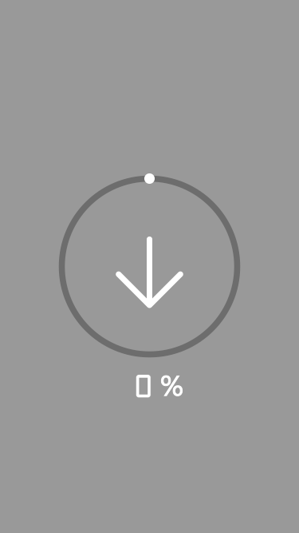

# flow

## 瀑布流
> 将生成的每张图片，插入到当前高度最矮的那一列。每次插入图片之前，需要对每列根据列的高度进行排序，将当前图片插入到最矮的那一列。

```js
    // 动态创建DOM 生成的图片
    const dom = createDOM(item)
    console.log(dom)

    // 对列进行高度排序
    flowCols.sort((a, b) => a.offsetHeight - b.offsetHeight)
    // 将生成标签（dom） 插入到最矮的那一列（flowCols[0]）
    flowCols[0].appendChild(dom)
```

### 前期准备

```js
  // 导入依赖 工具方法
  const { toJSON, likeAryTo, win, offset } = window._utils;

  // 获取操作元素 [li, li, li, li]
  const cols = document.querySelectorAll("#flow>li");
  // 将元素集合转换成数组(sort)
  const flowCols = Array.from(cols)
```

### 1.请求数据 getImgData()
```js
  // 获取图片数据
  function getImgData() {
    // 1.创建ajax实例
    const xhr = new XMLHttpRequest();
    // 2.配置请求方式 请求地址 是否同异步
    xhr.open("GET", "./data.json", false);
    // 3.监听数据响应
    xhr.onreadystatechange = function() {
      if (this.readyState === 4 && /^2\d{2}$/.test(this.status)) {
        // 通过renderDOM渲染数据
        renderDOM(toJSON(this.responseText))
      }
    };
    // 4.发送ajax请求
    xhr.send();
  }
  getImgData()
```

### 2.渲染数据 renderDOM()
> 根据每条数据item 利用 createDOM(item) 生成a标签，插入到当前最矮那一列

```js
  function renderDOM(data) {
    data.forEach(item => {
      // 动态创建DOM 生成的图片
      const dom = createDOM(item)
      console.log(dom)

      // 对列进行高度排序
      flowCols.sort((a, b) => a.offsetHeight - b.offsetHeight)
      // 将生成标签（dom） 插入到最矮的那一列（flowCols[0]）
      flowCols[0].appendChild(dom)
    })
  }
```

## 图片懒加载
> 一开始只让img显示默认图片，只有当图片出现在屏幕当中，才加载真实的图片

```js
   // 先加载默认图片 src="./images/load.gif"
   // 真实图片保存在标签属性img-src上 img-src="${src}"
   a.innerHTML = `
     
     <p class="title">${title}</p>
   `
```

### 懒加载处理
> 浏览器的scrollTop + 浏览器窗口的高度 >= 图片距离body的offsetTop + 图片自身高度，就说明出现在了屏幕当中，进行加载

懒加载判断条件：
```js
// 懒加载判断条件
if (win('scrollTop') + win('clientHeight') >= img.offsetTop + img.offsetHeight) {
  // 进行懒加载
}
```

#### 1.获取所有图片

```js
  // 获取页面中所有图片
  const imgAll = document.getElementsByTagName('img')
```

#### 2.获取当前浏览器窗口的scrollTop和clientHeight

```js
    const sTop = win('scrollTop')
    const winH = win('clientHeight')
```

#### 3.循环出来每一张图片进行判断

```js
for (let i = 0; i < imgAll.length; i++) {
  // img 循环出的每张图片
  const img = imgAll[i]
  
  // 判断当前img是否已经加载过（避免重复加载）
  // 如果当前img已经加载过，通过continue 忽略后面的懒加载逻辑， 直接跳到下一次循环 对下一张图片进行懒加载
  if(img.loaded) continue;
  
  // 获取img的距离body的offsetTop 和 img自身的高度
  const top = offset(img).top
  const height = img.offsetHeight
  
  // 懒加载条件
  // 如果条件成立为true, 说明img出现在了屏幕当中，需要进行懒加载
  if (sTop + winH >= top + height) {
    // 进行懒加载
    // 获取img保存在自身的标签属性"img-src"上的真实图片地址
    const src = img.getAttribute('img-src')
    
    // 检测图片有效性（保证图片地址是可用的）
    // 创建一个临时的图片
    let timg = new Image()
    // 让临时的图片，加载这个地址
    timg.src = src
    
    // 图片加载成功事件
    timg.onload = function() {
       // 把真实的图片地址 赋值给当前页面中img
       // img.src = src
       img.src = this.src
       // 标识当前图片已经加载过
       img.loaded = true
       timg = null
    }
  }
}
```

#### 封装lazyImg方法
```js
function lazyImg() {
    // 如何判断图片出现在可视区域
    // sTop + winH >= offsetTop + offsetHeight
    const sTop = win('scrollTop')
    const winH = win('clientHeight')

    for (let i = 0; i < imgAll.length; i++) {
      // 获取每张图片的offsetTop offsetHeight
      const img = imgAll[i]

      // 避免重复加载
      if (img.loaded) continue;

      // 获取图片距离body的offsetTop
      const top = offset(img).top // {left, top}
      // 获取图片自身高度
      const height = img.offsetHeight

      // win('scrollTop') + win('clientHeight') >= img.offsetTop + img.offsetHeight
      // 如果条件成立true, 说明img完全出现在屏幕当中 进行图片懒加载
      if (sTop + winH >= top + height) {
        // 获取img保存在自身标签属性"img-src"上的真实图片地址,
        const src = img.getAttribute('img-src')

        // img.src = src 图片地址有可能是无效的
        // 为了保证图片有效性
        let tempImg = new Image()
        tempImg.src = src

        // 图片加载成功事件
        tempImg.onload = function() {
          console.log('load')
          img.src = this.src

          // 标记图片已经加载
          img.loaded = true

          tempImg = null
        }
        // 图片加载失败事件
        tempImg.onerror = function() {
          console.log('图片地址无效的', this.src)
        }
      }
    }
  }
```

#### 何时进行懒加载
 - 首次加载数据时（加载首屏数据时），进行懒加载
 - 滚动滚动条加载更多数据时，实时进行懒加载
 
```js
  // 请求初始数据
  getImgData();
  // 懒加载初始数据
  lazyImg()

  // 监听滚动条滚动事件
  window.onscroll = function() {
    loadMore()
    lazyImg()
  }
```

## 加载更多
> 当页面快要到达底部时，再次往页面中加载更多数据，最开始只是加载的首屏数据。

加载条件
```js
if (win('scrollTop') + win('clientHeight') >= win('scrollHeight') - 200) {
  // 加载更多
}
```
### loadMore

```js
const { win } = window._utils
function loadMore() {
  // scrollHeight = clientHeight + scrollTop(最大值)
  // 当前滚动条滚动距离
  const sTop = win('scrollTop') 
  // 浏览器窗口一屏的高度
  const winH = win('clientHeight')
  // 整个浏览器页面的高度
  const sHeight = win('scrollHeight')
  
  // 加载更多
  if (sTop + winH >= sHeight - 200) {
    // 再次进行数据请求并加载
    getImgData()
  }
}
```

#### 滚动时，实时加载

```js
window.onscroll = function() {
  // 加载更多
  loadMore()
  // 针对加载更多的数据，进行懒加载
  lazyImg()
}
```
